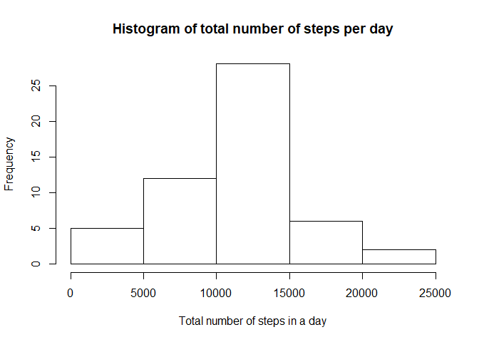
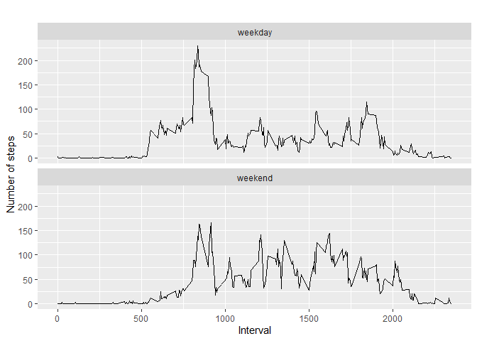

### **load all packages used in this exploratory analysis**


```r
library(dplyr)
```

```
## 
## Attaching package: 'dplyr'
```

```
## The following objects are masked from 'package:stats':
## 
##     filter, lag
```

```
## The following objects are masked from 'package:base':
## 
##     intersect, setdiff, setequal, union
```

```r
library(ggplot2)
```

### *Loading and preprocessing the data*

##### First, we read the data in from the zipped csv file and omit NAs:


```r
unzip('activity.zip')
activityData <- read.csv('activity.csv')

activityData_WithoutNan <- activityData[ with (activityData, { !(is.na(steps)) } ), ]
```

### **What is mean total number of steps taken per day?**

##### Let's Calculate the total number of steps taken per day :


```r
by_day <- group_by(activityData_WithoutNan, date)
steps_by_day <- summarise(by_day, total = sum(steps))
steps_by_day
```

```
## # A tibble: 53 x 2
##    date       total
##    <fct>      <int>
##  1 2012-10-02   126
##  2 2012-10-03 11352
##  3 2012-10-04 12116
##  4 2012-10-05 13294
##  5 2012-10-06 15420
##  6 2012-10-07 11015
##  7 2012-10-09 12811
##  8 2012-10-10  9900
##  9 2012-10-11 10304
## 10 2012-10-12 17382
## # ... with 43 more rows
```

##### create a histogram of the total number of steps per day : 


```r
hist(steps_by_day$total, main="Histogram of total number of steps per day", xlab="Total number of steps in a day")
```

<!-- -->

##### calculate the mean and median values : 


```r
stepsByDayMean <- mean(steps_by_day$total)
stepsByDayMedian <- median(steps_by_day$total)
```

### **What is the average daily activity pattern?**

##### Make a time series plot (i.e. type = “l”) of the 5-minute interval (x-axis) and the average number of steps taken, averaged across all days (y-axis)


```r
steps_by_interval <- aggregate(steps ~ interval, activityData_WithoutNan, mean)

plot(steps_by_interval$interval, steps_by_interval$steps, type='l', 
     main="Average number of steps over all days", xlab="Interval", 
     ylab="Average number of steps")
```

<!-- -->

##### Which 5-minute interval, on average across all the days in the dataset, contains the maximum number of steps?


```r
# find row with max of steps
max_steps_row <- which.max(steps_by_interval$steps)

# find interval with this max
steps_by_interval[max_steps_row, ]
```

```
##     interval    steps
## 104      835 206.1698
```

### **Imputing missing values**

##### Calculate and report the total number of missing values in the dataset (i.e. the total number of rows with NAs)


```r
sum(is.na(activityData))
```

```
## [1] 2304
```
 
##### My strategy is replacing NA’s with the mean for that 5-minute interval


```r
data_imputed <- activityData
for (i in 1:nrow(data_imputed)) {
  if (is.na(data_imputed$steps[i])) {
    interval_value <- data_imputed$interval[i]
    steps_value <- steps_by_interval[
      steps_by_interval$interval == interval_value,]
    data_imputed$steps[i] <- steps_value$steps
  }
}
```

##### Create a new dataset that is equal to the original dataset but with the missing data filled in


```r
df_imputed_steps_by_day <- aggregate(steps ~ date, data_imputed, sum)
head(df_imputed_steps_by_day)
```

```
##         date    steps
## 1 2012-10-01 10766.19
## 2 2012-10-02   126.00
## 3 2012-10-03 11352.00
## 4 2012-10-04 12116.00
## 5 2012-10-05 13294.00
## 6 2012-10-06 15420.00
```

##### Make a histogram of the total number of steps taken each day


```r
hist(df_imputed_steps_by_day$steps, main="Histogram of total number of steps per day (imputed)", 
     xlab="Total number of steps in a day")
```

<!-- -->

##### get mean and median of imputed data

```r
mean(df_imputed_steps_by_day$steps)
```

```
## [1] 10766.19
```


```r
median(df_imputed_steps_by_day$steps)
```

```
## [1] 10766.19
```

##### get mean and median of data without NA's

```r
mean(steps_by_day$total)
```

```
## [1] 10766.19
```


```r
median(steps_by_day$total)
```

```
## [1] 10765
```

##### **Mean values stays the same but therer is slight difference in meadian value**

### **Are there differences in activity patterns between weekdays and weekends?**

##### Create a new factor variable in the dataset with two levels – “weekday” and “weekend” indicating whether a given date is a weekday or weekend day.


```r
data_imputed['type_of_day'] <- weekdays(as.Date(data_imputed$date))
data_imputed$type_of_day[data_imputed$type_of_day  %in% c('Saturday','Sunday') ] <- "weekend"
data_imputed$type_of_day[data_imputed$type_of_day != "weekend"] <- "weekday"

# convert type_of_day from character to factor
data_imputed$type_of_day <- as.factor(data_imputed$type_of_day)
```

##### plot a time series plot (i.e. type = “l”) of the 5-minute interval (x-axis) and the average number of steps taken, averaged across all weekday days or weekend days (y-axis).


```r
# calculate average steps by interval across all days
df_imputed_steps_by_interval <- aggregate(steps ~ interval + type_of_day, data_imputed, mean)

# creat a plot
qplot(interval, 
      steps, 
      data = df_imputed_steps_by_interval, 
      type = 'l', 
      geom=c("line"),
      xlab = "Interval", 
      ylab = "Number of steps", 
      main = "") +
  facet_wrap(~ type_of_day, ncol = 1)
```

```
## Warning: Ignoring unknown parameters: type
```

<!-- -->
